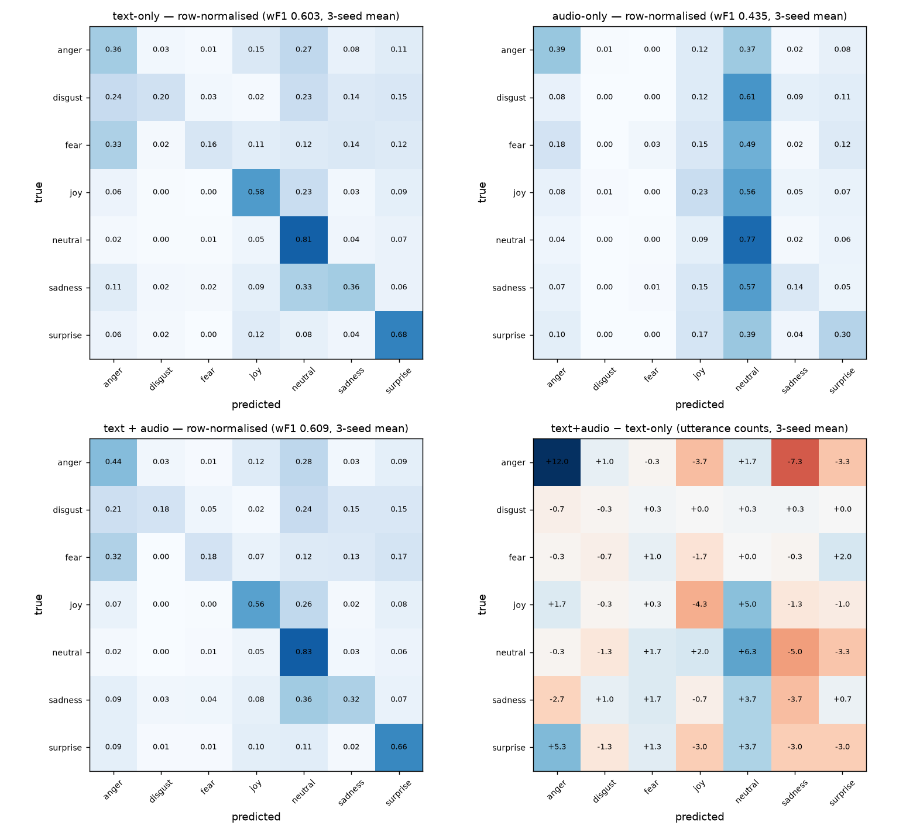
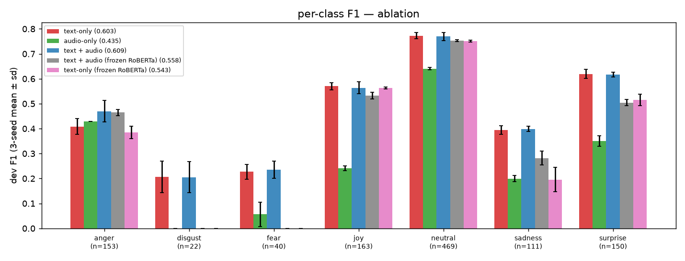

<!-- generated by src/ablation_day13.py -->
# Experiments

_Auto-generated by `src/ablation_day13.py` on 2026-10-04 16:22 — re-running overwrites this file._

All numbers are on the MELD **dev** split restricted to utterances with audio (n = 1108). The test split has not been used yet. Each configuration is trained with seeds 42 / 43 / 44; for every seed we keep the epoch with the highest dev weighted F1 and report mean ± sd over seeds.

## Setup

- Text: `roberta-base`, `<s>` vector, fine-tuned (lr 2e-5), LayerNorm before fusion
- Audio: `facebook/wav2vec2-base` (frozen, pre-extracted), mean-pooled over time for all 13 hidden states, learnable softmax-weighted layer sum → LayerNorm
- Fusion: concat → Dropout → Linear(·, 256) → ReLU → Dropout → Linear(256, 7); head / layer weights / LN lr 1e-3
- AdamW (wd 0.01), 10% linear warm-up then linear decay, grad clip 1.0, bf16, batch 16, 5 epochs, no class weights
- Single-modality rows use the **same** `LateFusionClassifier` with one input branch (fusion head input 768)
- Epochs trained per row: text-only 5, audio-only 20, text + audio 5, text + audio (frozen RoBERTa) 5, text-only (frozen RoBERTa) 5 (audio-only peaked at the last epoch with 5, so it was re-run longer)

## Ablation

| model | input | RoBERTa | dev acc | dev weighted F1 | dev macro F1 | best epochs |
|---|---|---|---|---|---|---|
| text-only | text | fine-tuned | 0.6179 ± 0.0128 | 0.6029 ± 0.0017 | 0.4567 ± 0.0128 | [4, 2, 2] |
| audio-only | audio (wav2vec2, 13 layers) | — | 0.4723 ± 0.0041 | 0.4352 ± 0.0015 | 0.2740 ± 0.0036 | [13, 14, 20] |
| **text + audio** | text + audio | fine-tuned | 0.6252 ± 0.0144 | 0.6094 ± 0.0077 | 0.4654 ± 0.0140 | [5, 3, 2] |
| text + audio (frozen RoBERTa) | text + audio | frozen | 0.5990 ± 0.0010 | 0.5576 ± 0.0013 | 0.3622 ± 0.0009 | [5, 4, 5] |
| text-only (frozen RoBERTa) | text | frozen | 0.5912 ± 0.0028 | 0.5432 ± 0.0056 | 0.3443 ± 0.0067 | [4, 3, 5] |
| text-only · TextClassifier (Day 6, n=1109) |  |  | 0.618 ± 0.003 | 0.6040 ± 0.0024 | 0.458 ± 0.003 | [2, 3, 3] |
| audio linear probe (Day 9, mean13, 1 run) |  |  | 0.456 | 0.424 | 0.270 | — |
| always neutral |  |  | 0.4233 | 0.2518 | 0.0850 | — |

Paired bootstrap over dev utterances (2000 resamples; in each resample both models' weighted F1 is averaged over their 3 seeds):

| comparison | Δ weighted F1 | 95% CI | Δ / pooled seed sd |
|---|---|---|---|
| text+audio vs text-only (what audio adds) | +0.0065 | [-0.0040, +0.0183] | 1.2 |
| text+audio vs audio-only (what text adds) | +0.1742 | [+0.1445, +0.2032] | 31.5 |
| text-only vs audio-only | +0.1677 | [+0.1349, +0.1975] | 104.8 |
| fine-tuned vs frozen RoBERTa (both text+audio) | +0.0518 | [+0.0294, +0.0737] | 9.4 |
| frozen RoBERTa: text+audio vs text-only (what audio adds) | +0.0145 | [-0.0037, +0.0321] | 3.5 |

## Per-class F1 (3-seed mean)

| class | n | text-only | audio-only | text + audio | text + audio (frozen RoBERTa) | text-only (frozen RoBERTa) | Δ (text+audio − text) |
|---|---|---|---|---|---|---|---|
| anger | 153 | 0.408 | 0.429 | 0.470 | 0.465 | 0.385 | +0.062 |
| disgust | 22 | 0.206 | 0.000 | 0.205 | 0.000 | 0.000 | -0.000 |
| fear | 40 | 0.227 | 0.057 | 0.235 | 0.000 | 0.000 | +0.008 |
| joy | 163 | 0.570 | 0.242 | 0.563 | 0.532 | 0.564 | -0.007 |
| neutral | 469 | 0.773 | 0.640 | 0.769 | 0.753 | 0.751 | -0.003 |
| sadness | 111 | 0.395 | 0.200 | 0.399 | 0.282 | 0.196 | +0.004 |
| surprise | 150 | 0.619 | 0.351 | 0.617 | 0.504 | 0.515 | -0.003 |





## Modality reliance (text + audio, best epoch, 3 seeds)

- Shuffling the audio features across dev utterances changes weighted F1 by -0.0234 ± 0.0074; shuffling the text changes it by -0.3494 ± 0.0067.
- With RoBERTa frozen, shuffling audio changes weighted F1 by -0.0826 ± 0.0086.

## Earlier experiments (seed 42 unless noted)

**Class weights, text-only (Day 6, 3 seeds, dev 1109):** none 0.604 ± 0.002 · sqrt 0.598 ± 0.009 · balanced 0.578 ± 0.009 (weighted F1) → no class weights.

**Fusion scale fix and head lr (Day 11, 1 epoch):** text_ln 0.595 · none 0.588 · audio_gain 0.582; head lr 1e-4 0.573 · 3e-4 0.579 · 1e-3 0.595 · 3e-3 0.582; frozen RoBERTa 0.495 → text_ln, 1e-3, fine-tune RoBERTa.

**Audio layer probe (Day 9, logistic regression per wav2vec2 layer):** middle layers (4–10) best; mean of 13 layers 0.424 weighted F1 ≈ best single layer (layer 8, 0.421).

## Commands

```
python src\fusion_day12.py --modalities text --tag day13_text
python src\fusion_day12.py --modalities audio --tag day13_audio_e20
python src\fusion_day12.py
python src\fusion_day12.py --freeze-text --tag day12_frozen
python src\fusion_day12.py --modalities text --freeze-text --tag day13_text_frozen
python src\ablation_day13.py
```
