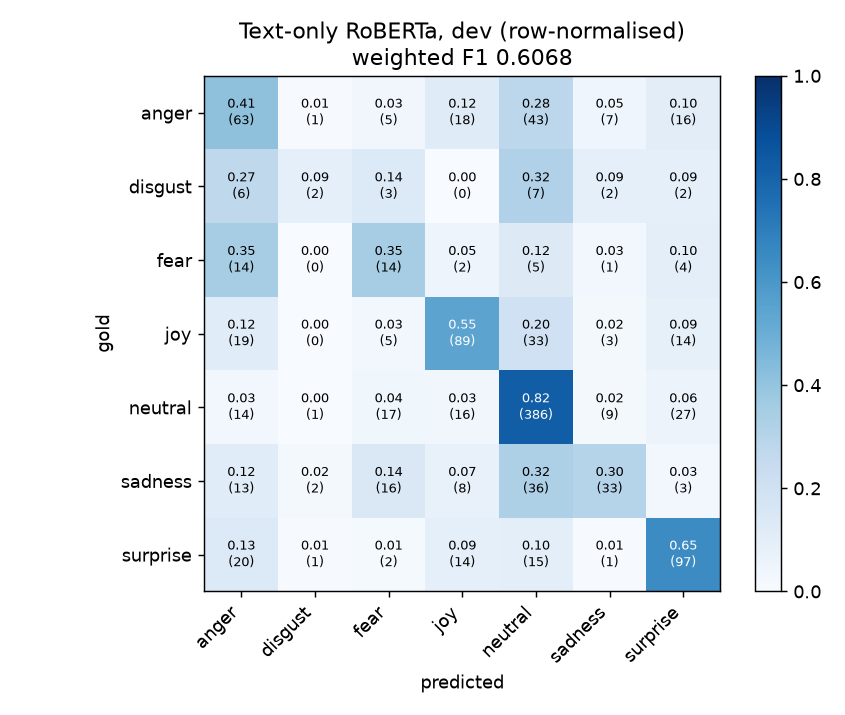

# Multimodal Emotion Recognition on MELD

Text + speech emotion recognition on **MELD** (multi-party conversations from the TV series *Friends*, 7 emotion classes).
The question this project asks: **how much do acoustic cues (prosody, energy, pitch) add on top of a strong fine-tuned text model?**

> **Status:** Phase 1 complete: data pipeline, Whisper ASR analysis, text-only RoBERTa baseline.
> Phase 2 (Wav2Vec 2.0 audio features, late fusion, ablations) is in progress.

---

## Phase 1 results: text-only baseline

RoBERTa-base fine-tuned on the utterance text and evaluated on the MELD **dev** split (1,109 utterances).
Each configuration was run with 3 seeds (42 / 43 / 44). Each run reports its best epoch by dev weighted F1, and the table gives mean ± std.
**The test split has not been used yet.** It is reserved for the final configuration.

| Model | Class weights in loss | Dev accuracy | Dev weighted F1 | Dev macro F1 |
|---|---|---|---|---|
| Majority class (always *neutral*) | – | 0.424 | 0.252 | 0.085 |
| **RoBERTa-base** | **none** | **0.618 ± 0.003** | **0.604 ± 0.002** | 0.458 ± 0.003 |
| RoBERTa-base | sqrt(balanced) | 0.608 ± 0.005 | 0.598 ± 0.009 | 0.467 ± 0.018 |
| RoBERTa-base | balanced | 0.572 ± 0.008 | 0.578 ± 0.009 | 0.451 ± 0.005 |

Weighted F1 is the primary metric, following common practice on MELD.
*balanced* = N / (K · n_c), which gives a ~17× ratio between the rarest and most frequent class. *sqrt* is its square root (~4×).

**Per-class results** for the reference run (no class weights, seed 42, best epoch 2):

| Emotion | Precision | Recall | F1 | Support |
|---|---|---|---|---|
| anger | 0.423 | 0.412 | 0.417 | 153 |
| disgust | 0.286 | 0.091 | 0.138 | 22 |
| fear | 0.226 | 0.350 | 0.275 | 40 |
| joy | 0.605 | 0.546 | 0.574 | 163 |
| neutral | 0.735 | 0.821 | 0.776 | 470 |
| sadness | 0.589 | 0.297 | 0.395 | 111 |
| surprise | 0.595 | 0.647 | 0.620 | 150 |



### What the text model gets wrong

- **Everything collapses towards *neutral*.** 32% of sadness, 32% of disgust, 28% of anger and 20% of joy utterances are predicted as neutral.
- **Short utterances are ambiguous as text.** The most confident errors are one- or two-word lines such as *"No."* (gold: sadness, predicted neutral with p = 0.98) and *"Yeah."* (gold: joy, predicted neutral with p = 0.97). The emotion here is carried by *how* the line is said, not by the words. This is the core motivation for adding audio.
- **Accuracy drops with length** (1–2 words: 0.74 → 11+ words: 0.52). Short lines are mostly neutral and easy to guess; longer lines mix cues.
- **Class weighting does not help the primary metric.** Across 3 seeds, balanced weights cost 0.026 weighted F1 (~3 std), mainly by lowering neutral F1. sqrt weights roughly double disgust F1 (0.34 vs 0.18), but disgust has only 22 dev examples and fear gets worse. Its weighted and macro F1 differences are within seed noise. The baseline therefore uses unweighted cross-entropy, and minority-class performance is left as a comparison point for the multimodal model.
- **Overfitting starts early.** Dev loss is lowest at epoch 2. All 9 runs peak between epochs 2 and 4.

### Whisper ASR on MELD (for the end-to-end pipeline)

I transcribed all 9,988 train clips with whisper-small and scored them against the gold transcripts. Both sides were normalised with Whisper's `EnglishTextNormalizer`.

| Corpus WER | WER (refs ≥ 3 words) | Median per-utterance WER | Exact transcripts |
|---|---|---|---|
| 0.313 | 0.283 | 0.167 | 33% |

The worst errors come from two sources:
- **Hallucination on very short clips.** For example, a 1–2 word clip becomes dozens of words of "thanks for watching"-style text.
- **Clip boundaries.** MELD segments follow subtitle timestamps, so a clip can contain another speaker's line.

Main experiments therefore use gold transcripts. Whisper output is used in the demo and in a planned "realistic ASR" ablation.

---

## Data

- **Labels:** official CSVs from the [MELD GitHub repo](https://github.com/declare-lab/MELD) (train 9,989 / dev 1,109 / test 2,610 utterances).
  The Hugging Face copy (`declare-lab/MELD`) only contains the raw video tarball, so `load_dataset` cannot parse it.
- **Audio:** the raw `.mp4` clips (10.9 GB) are converted to 16 kHz mono WAV with ffmpeg. One train clip is unreadable and is skipped.
- **Text cleaning:** the `Utterance` column contains Windows-1252 / mojibake artefacts (`\x92`, `’`, curly quotes). `fix_text` repairs them, and 2,736 of 9,989 train utterances change.
- **Class imbalance:** neutral is 47% of train, while disgust and fear are under 3% each.
- **Label ids (fixed for the whole project):** 0 anger, 1 disgust, 2 fear, 3 joy, 4 neutral, 5 sadness, 6 surprise (stored in `results/label_map.json`).

The dataset is not redistributed in this repository.

## Training setup (text baseline)

- **Model:** RoBERTa-base, with the `<s>` token representation fed to dropout 0.1 and then Linear(768, 7).
- **Optimiser:** AdamW, lr 2e-5, weight decay 0.01 (not applied to bias / LayerNorm), 10% linear warm-up then linear decay, gradient clipping 1.0.
- **Batching:** batch size 16, max length 128 (no utterance is truncated; the 99th percentile is 37 tokens), dynamic padding.
- **Precision and schedule:** bf16 autocast, 5 epochs, checkpoint selected by dev weighted F1.
- **Speed:** about 25 s per epoch on a single RTX 4090.

## Setup

```bash
conda create -n emotion_ai python=3.11 -y
conda activate emotion_ai
# Install PyTorch for your CUDA version first: https://pytorch.org/get-started/locally/
python -m pip install -r requirements.txt
# ffmpeg (used by extract_audio.py)
python -m pip install imageio-ffmpeg
```

Model weights are cached under `HF_HOME`. The scripts default to `F:\hf_cache`. Set the `HF_HOME` environment variable to override this.

## Reproducing Phase 1

```bash
python src/download_meld.py            # label CSVs + raw videos (10.9 GB), extract, check
python src/extract_audio.py            # mp4 -> 16 kHz mono wav
python src/whisper_wer.py --all --split train   # Whisper transcripts + WER analysis
python src/roberta_day4.py             # tokenizer / forward-pass checks; writes results/label_map.json
python src/text_day6.py --sweep        # 3 class-weight schemes x 3 seeds x 5 epochs (~25 min on an RTX 4090)
```

## Repository layout

```
src/          data preparation, ASR analysis and training scripts
notebooks/    exploratory notebooks (label distribution, waveforms)
results/      metrics, logs and figures (checkpoints are not committed)
data/         MELD data (not committed)
```

## Roadmap

- [x] Phase 1: data pipeline, Whisper WER analysis, text-only RoBERTa baseline
- [ ] Phase 2: Wav2Vec 2.0 audio embeddings, late-fusion model, text / audio / multimodal ablation (3 seeds each), test-set evaluation
- [ ] Phase 3: Gradio demo (audio → Whisper → emotion), Hugging Face Spaces deployment

## Reference

Poria, S., Hazarika, D., Majumder, N., Naik, G., Cambria, E., & Mihalcea, R. (2019).
*MELD: A Multimodal Multi-Party Dataset for Emotion Recognition in Conversations.* ACL 2019.
