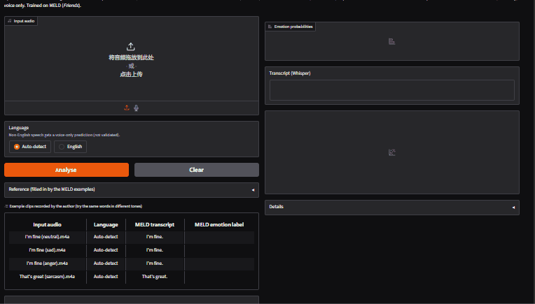
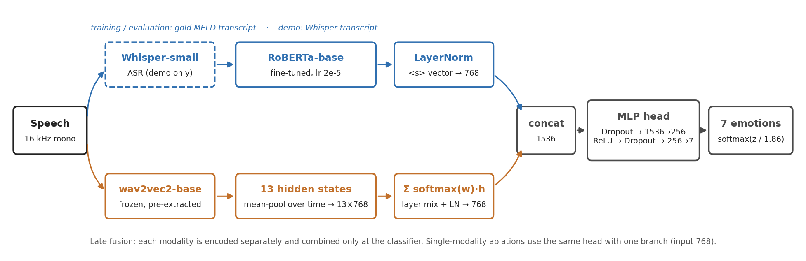
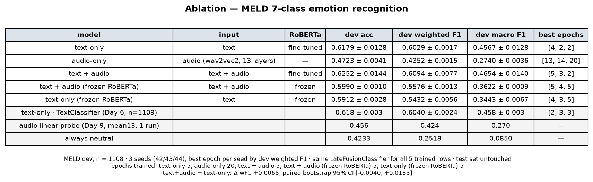
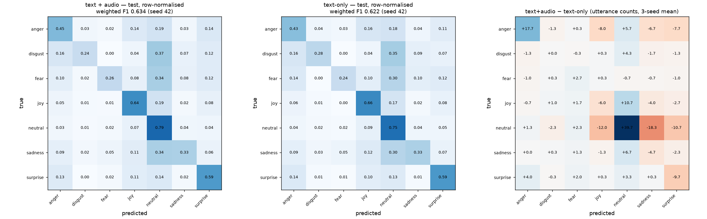
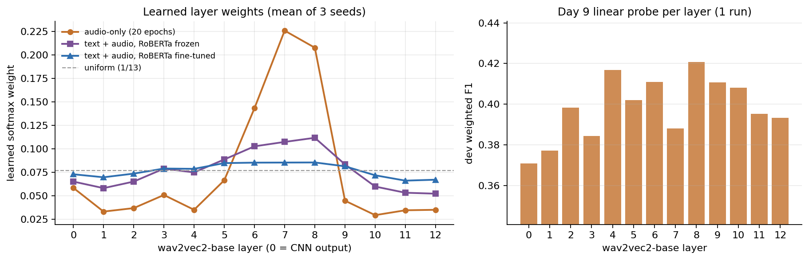

# Multimodal Emotion Recognition on MELD


[](https://huggingface.co/Aiyeee/meld-emotion-late-fusion)

Speech + text emotion recognition on **MELD** (multi-party dialogue from the TV series *Friends*, 7 emotion classes).
The question this project asks: **how much do acoustic cues add on top of a strong fine-tuned text model, and where do they help?**

RoBERTa-base (text) and wav2vec 2.0 (speech) are combined with a late-fusion MLP. Every configuration is trained with 3 seeds, compared with paired bootstrap tests, and wrapped in a Gradio demo (speech → Whisper → emotion).



*The demo transcribes the clip with Whisper, then shows the fused prediction, a three-model comparison (text + voice / text only / voice only), and a waveform and spectrogram. In this recording, "I'm fine." is said neutrally, sadly and angrily, and the fused prediction stays neutral; a sarcastic "That's great." comes out as joy. Both are [limitations](#limitations) discussed below.*

**Headline result (MELD test, 2,610 utterances, 3 seeds):** text + audio reaches **63.9 ± 0.9** weighted F1 against **62.6 ± 0.7** for the same model without audio, a **+1.3 point** gain (paired bootstrap 95% CI [+0.5, +2.0]; positive for every seed). The gain is small but consistent, and **anger** benefits most.

---

## Contents

- [Model](#model)
- [Results](#results)
- [What the audio branch does](#what-the-audio-branch-does)
- [With a real ASR front end](#with-a-real-asr-front-end)
- [Limitations](#limitations)
- [Data notes](#data-notes)
- [Setup and reproduction](#setup-and-reproduction)
- [Repository layout](#repository-layout)

## Model



| Component | Details |
|---|---|
| Text | `roberta-base`, `<s>` vector, **fine-tuned** (lr 2e-5), then LayerNorm |
| Speech | `facebook/wav2vec2-base` (**frozen**, features pre-extracted). Each of the 13 hidden states is mean-pooled over time, combined with a learnable softmax-weighted sum, then LayerNorm |
| Fusion | concat (1536) → Dropout 0.1 → Linear(1536, 256) → ReLU → Dropout → Linear(256, 7). Head, layer weights and LayerNorms use lr 1e-3 |
| Training | AdamW (wd 0.01), 10% warm-up then linear decay, grad clip 1.0, bf16, batch 16, 5 epochs, unweighted cross-entropy. Each seed keeps the epoch with the best dev weighted F1 |
| Calibration | temperature scaling fitted on dev (T = 1.86) |

Design choices, each backed by an experiment in [EXPERIMENTS.md](EXPERIMENTS.md):
- **Fine-tune RoBERTa together with the fusion head.** With RoBERTa frozen, text + audio drops from 0.609 to 0.558 dev weighted F1.
- **Put both branches on the same scale.** Without the text LayerNorm, the audio vector is about 2.4× larger than the text vector at initialisation.
- **Use all 13 wav2vec2 layers, not the last one.** The last layer is specialised for the pre-training objective. A linear probe on it scores 0.393 dev weighted F1, against 0.424 for the mean of all layers.
- **Keep the comparison fair.** The text-only and audio-only rows use the *same* `LateFusionClassifier` with one branch, so differences come from the input modality rather than the architecture.

## Results

Weighted F1 is the primary metric, following common practice on MELD. Model selection used only the dev split. The test split was evaluated once, with configurations fixed in advance ([`results/test_results.txt`](results/test_results.txt)).

### Test set (n = 2,610, mean ± sd over seeds 42 / 43 / 44)

| Model | Test accuracy | Test weighted F1 | Test macro F1 |
|---|---|---|---|
| **Text + audio** (late fusion) | **0.651** | **0.639 ± 0.008** | **0.467 ± 0.015** |
| Text only (same head) | 0.636 | 0.626 ± 0.007 | 0.451 ± 0.017 |
| Audio only (same head, 20 epochs) | 0.492 | 0.455 ± 0.003 | 0.257 ± 0.001 |
| Majority class (*neutral*) | 0.481 | 0.313 | – |

Paired bootstrap over test utterances (2,000 resamples, each model averaged over its 3 seeds):

| Comparison | Δ weighted F1 | 95% CI |
|---|---|---|
| **text + audio − text only** (what audio adds) | **+0.013** | **[+0.005, +0.020]** |
| text + audio − audio only (what text adds) | +0.184 | [+0.166, +0.203] |
| text only − audio only | +0.172 | [+0.151, +0.191] |

The per-seed differences are +0.012, +0.014 and +0.012. Removing the 42 test clips whose audio is shared with other utterances changes every score by at most 0.0007 (see [Data notes](#data-notes)).

### Dev ablation (n = 1,108, 3 seeds)

| Model | RoBERTa | Dev weighted F1 | Dev macro F1 |
|---|---|---|---|
| Text only | fine-tuned | 0.603 ± 0.002 | 0.457 ± 0.013 |
| Audio only | – | 0.435 ± 0.002 | 0.274 ± 0.004 |
| **Text + audio** | fine-tuned | **0.609 ± 0.008** | **0.465 ± 0.014** |
| Text + audio | frozen | 0.558 ± 0.001 | 0.362 ± 0.001 |
| Text only | frozen | 0.543 ± 0.006 | 0.344 ± 0.007 |
| Majority class | – | 0.252 | 0.085 |

On dev, adding audio gives +0.0065 (95% CI [−0.004, +0.018]). The direction matches test, but the dev split is 2.4× smaller and the interval includes zero. **The audio gain is consistent on test and not resolved on dev.** I report both instead of choosing one.



### Per-class F1 (test, 3-seed mean)

| Emotion | n | Text only | Audio only | Text + audio | Δ test | Δ dev |
|---|---|---|---|---|---|---|
| **anger** | 345 | 0.458 | 0.334 | **0.498** | **+0.041** | **+0.062** |
| disgust | 68 | 0.238 | 0.000 | 0.247 | +0.009 | −0.000 |
| fear | 50 | 0.166 | 0.011 | 0.204 | +0.038 | +0.008 |
| joy | 402 | 0.595 | 0.279 | 0.600 | +0.005 | −0.007 |
| neutral | 1256 | 0.782 | 0.660 | 0.791 | +0.010 | −0.003 |
| sadness | 208 | 0.360 | 0.190 | 0.370 | +0.010 | +0.004 |
| surprise | 281 | 0.559 | 0.323 | 0.560 | +0.001 | −0.003 |

**Anger is the only class that improves clearly on both splits.** The confusion-matrix difference (3-seed mean) shows anger utterances are less often mistaken for joy (−8.0), surprise (−7.7) and sadness (−6.7) once audio is added. The fear gain rests on only 50 test utterances. The hardest pairs overall are anger ↔ surprise, joy ↔ neutral and joy ↔ surprise. Predictions still collapse towards *neutral*: 31% of all errors are predicted as neutral.



### Calibration

The selected checkpoint is over-confident: dev loss rises after epoch 2 while F1 stays flat. A single temperature fitted on dev (T = 1.86) brings test **ECE from 0.175 to 0.024** and test NLL from 1.30 to 1.08 without changing any prediction. The demo shows calibrated probabilities.

## What the audio branch does

- **The model uses audio, but text dominates.** Shuffling the audio features across dev utterances lowers weighted F1 by 0.023 ± 0.007, while shuffling the text lowers it by 0.349. With RoBERTa frozen, the audio drop is 3.5× larger (−0.083). Once fine-tuned, the text branch does most of the work.
- **The middle wav2vec2 layers carry the emotion signal.** This shows up independently in the learned softmax layer weights and in a per-layer linear probe. Audio-only training puts 58% of its weight on layers 6–8, and the last two layers are down-weighted in every setting. The probe differences between layers (~0.02) are close to dev noise, so the learned weights are the stronger evidence.



- **Example of a fix.** Dev `dia5_utt6`, *"It, it's too late, I'm with somebody else, I'm happy."* (gold: anger), is predicted as sadness by text-only in all 3 seeds and as anger by text + audio in all 3 seeds. Most improvements are less tidy: different seeds fix different utterances.

## With a real ASR front end

The main experiments use MELD's gold transcripts. The demo uses Whisper-small instead, so I re-evaluated the same checkpoints (seed 42) on Whisper transcripts. Corpus WER is 0.26 on dev and 0.35 on test.

| Test weighted F1 | Gold transcript | Whisper-small transcript |
|---|---|---|
| Text + audio | 0.634 | 0.523 |
| Text only | 0.622 | 0.510 |
| Audio only | 0.456 | 0.456 |
| **Audio adds** | +0.012 [−0.000, +0.024] | **+0.013 [+0.002, +0.025]** |

- ASR costs about 11 points of weighted F1. Part of the WER comes from MELD's clip boundaries rather than recognition errors (see below).
- **Audio helps more when the transcript is noisy.** With Whisper text, the audio gain has a confidence interval that excludes zero on both splits (dev +0.023 [+0.004, +0.042]). These figures are for a single seed.

## Limitations

- **Late fusion is dominated by text.** When the words are confidently neutral, the voice cannot override them. In the demo, "I'm fine." said angrily, neutrally or sadly is predicted neutral (~82%) every time. Test `dia252_utt5`, *"Does that seem like something you can do."* (gold: anger), is predicted neutral by text + audio, while the audio-only model gets it right.
- **No sarcasm label.** MELD has no sarcasm class, so a sarcastic "That's great." is predicted joy (92%). The demo flags this kind of case with a *tone vs words* hint when the voice-only model disagrees with the result.
- **One acoustic domain.** The audio branch has only seen *Friends* (studio audio, professional actors). On my own microphone recordings, voice-only predictions mostly fall back to neutral.
- **Utterance-level only.** No dialogue context is used. The previous turns often decide the emotion in MELD.

Possible next steps: cross-modal attention or confidence-gated fusion instead of concatenation; training the speech branch on several corpora for speaker and channel robustness; training the text branch on ASR transcripts so training matches deployment; cross-lingual transfer (e.g. XLM-R with a Chinese corpus such as M3ED).

## Data notes

- **Labels:** official CSVs from the [MELD GitHub repo](https://github.com/declare-lab/MELD) (train 9,989 / dev 1,109 / test 2,610). The Hugging Face copy (`declare-lab/MELD`) only contains the raw video tarball. Clips are converted from `.mp4` to 16 kHz mono WAV with ffmpeg. One train clip and one dev clip have no audio, so the multimodal split is 9,988 / 1,108 / 2,610.
- **Text cleaning:** the `Utterance` column contains mojibake (`\x92`, `’`, curly quotes). `fix_text` repairs 2,736 train utterances.
- **Class imbalance:** neutral is 47% of train, while disgust and fear are under 3% each. Class-weighted losses were tried for the text baseline (3 seeds) and lowered weighted F1, so all models use unweighted cross-entropy.
- **Duplicate audio:** 85 clips in 40 groups have bit-identical audio (`results/day9_audio_duplicates.csv`). Some are whole dialogues included twice, including 2–3 test clips that also appear in train; others are neighbouring utterances cut from the same span. I kept the official splits for comparability and report scores with these clips removed. The scores change by at most 0.0007.
- **Clip boundaries:** segments follow subtitle timestamps, so a clip can contain the next line (dev `dia1_utt7` already includes `utt8`'s "On the tushy"), and some transcripts are truncated (`dia1_utt9` is labelled "And").
- **Long clips:** 11 clips (up to 305 s, segmentation errors) are truncated to 20 s for feature extraction.
- **Label ids:** 0 anger, 1 disgust, 2 fear, 3 joy, 4 neutral, 5 sadness, 6 surprise (`results/label_map.json`).

The dataset is not redistributed in this repository.

## Setup and reproduction

```bash
conda create -n emotion_ai python=3.11 -y
conda activate emotion_ai
# install PyTorch for your CUDA version first: https://pytorch.org/get-started/locally/
python -m pip install -r requirements.txt
```

Hugging Face and Whisper weights are cached under `HF_HOME` / `WHISPER_MODEL_DIR`. The scripts default to `F:\hf_cache`, so set both environment variables on other machines.

**Data and features**

```bash
python src/download_meld.py                     # label CSVs + raw videos (10.9 GB)
python src/extract_audio.py                     # mp4 -> 16 kHz mono wav
python src/whisper_wer.py --all --split train   # Whisper transcripts + WER (repeat for dev / test)
python src/roberta_day4.py                      # tokenizer checks; writes results/label_map.json
python src/audio_day9.py                        # wav2vec2 13-layer features for all splits (~3 min)
```

**Training and evaluation** (times on one RTX 4090)

```bash
python src/fusion_day12.py                                   # text + audio, 3 seeds x 5 epochs (~9 min)
python src/fusion_day12.py --modalities text --tag day13_text
python src/fusion_day12.py --modalities audio --epochs 20 --tag day13_audio_e20
python src/fusion_day12.py --freeze-text --tag day12_frozen
python src/fusion_day12.py --modalities text --freeze-text --tag day13_text_frozen
python src/ablation_day13.py --audio-tag day13_audio_e20     # dev ablation tables + EXPERIMENTS.md
python src/test_day14.py --retrain-seeds 43 44               # one-off test evaluation, bootstrap, calibration
python src/app_day16.py --asr-eval dev test                  # Whisper-transcript evaluation
python src/figures_day18.py                                  # architecture + layer-weight figures
```

Training is deterministic: re-training a seed reproduces its dev score exactly.

**Demo**

```bash
python src/app_day16.py                  # http://127.0.0.1:7860, Whisper-small
python src/app_day16.py --model turbo    # larger ASR model if you have a GPU
python src/app_day16.py --selftest 20    # check online features / predictions against the stored ones
```

The trained checkpoints (text + audio, text only, audio only) and calibration files are on the Hugging Face Hub: [Aiyeee/meld-emotion-late-fusion](https://huggingface.co/Aiyeee/meld-emotion-late-fusion). Download them into `results/` to run the demo without training. `space/app.py` downloads them automatically.

## Repository layout

```
src/            data preparation, feature extraction, training, evaluation, demo, deployment
  fusion_day10.py    dataset + LateFusionClassifier
  fusion_day12.py    multi-seed training (all ablation rows)
  ablation_day13.py  dev ablation tables / figures (no training)
  test_day14.py      the only script that reads the test split
  app_day16.py       Gradio demo
space/          Hugging Face Space entry point (app.py) and demo example list
docs/           architecture diagram, demo GIF
results/        metrics, logs and figures (checkpoints and feature arrays are not committed)
notebooks/      exploratory notebooks
EXPERIMENTS.md  full experiment log with commands (auto-generated)
```

## Reference

Poria, S., Hazarika, D., Majumder, N., Naik, G., Cambria, E., & Mihalcea, R. (2019).
*MELD: A Multimodal Multi-Party Dataset for Emotion Recognition in Conversations.* ACL 2019.
